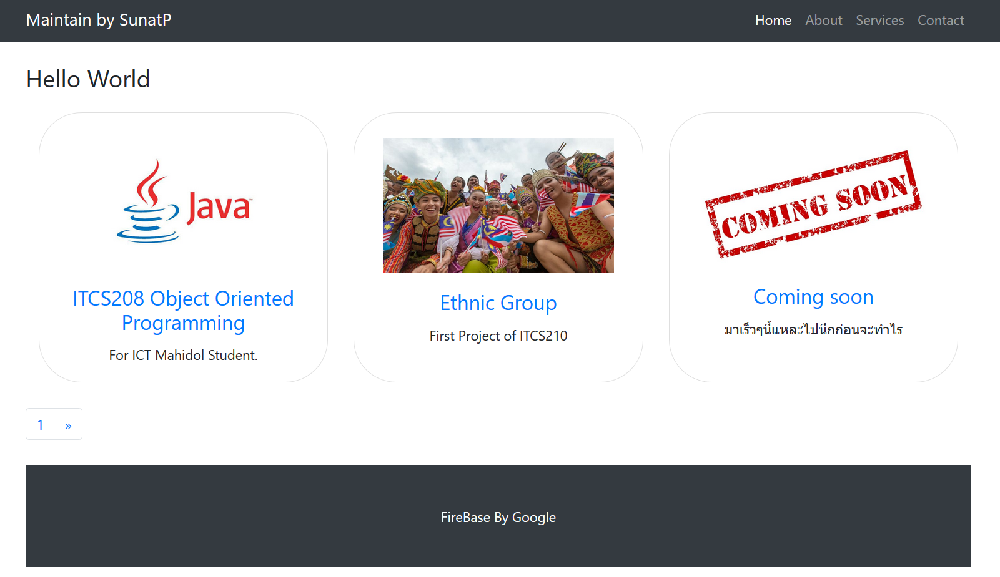

  

## แรกเริ่มเดิมที
ก็เพราะว่าตอนปี 2 เราได้เรียนวิชา Web Programming เราก็เลยนั่งทำเว็บไซต์ขึ้นมาเป็น   **HTML + CSS + JS** เป็น Static Website แบบง่ายๆแล้วก็ Deploy ขึ้น Firebase ซะเลย คราวนี้ทำไปได้สักพักก็สนใจละ จะไม่ให้คนเห็นพวก CSS ทีเราทำยังไงกับซ่อนนามสกุลของเว็บที่มันเป็น **.html** ได้ไงทุกครั้งที่เปลี่ยนหน้าเว็บด้วย   
นี่ไงหน้าเว็บอย่างง่ายของเรา

  
แค่สร้างเว็บมาก็ใช้สเกล 120% ซะแล้ว 55555 (ครั้งแรกทำได้แบบนี้ก็ดีใจแล้วโดยเฉพาะขึ้น Firebase ได้นี่ยิ่งดีใจใหญ่เลย)
## ทำไมถึงหันมาใช้เจ้า Gatsby ที่เป็น React?
    * อยากปรับปรุงเรื่องหน้าเพจให้พวกเนื้อหาข้างในเบาขึ้นมากถึงมากที่สุด (ยกเครื่องใหม่นั่นแหละ ดูว่างใช่ป่ะ 555)
    * Plugin ของเจ้า Gatsby นี่ตอบโจทย์มากๆสำหรับ Static Website (ยังใช้ไม่ค่อยเป็นเลย!!)
    * ฝึกเขียน Javascript (React) ด้วย (JS มีความรู้แค่งูๆปลาๆเอง 555 😂)
    * อยากเพิ่มสกิลการเขียนเว็บที่ไม่ใช่ PHP หรือ HTML ด้วยแหละ (พูดกับเพื่อนด้วยนะว่าปิดเทอมจะไปยกเครื่องเว็บไซต์ใหม่เลย 555)